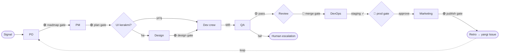
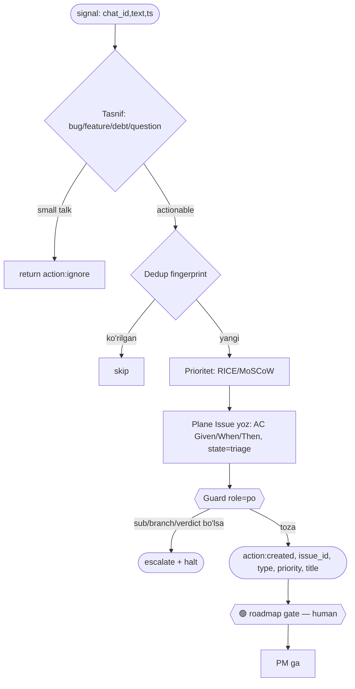
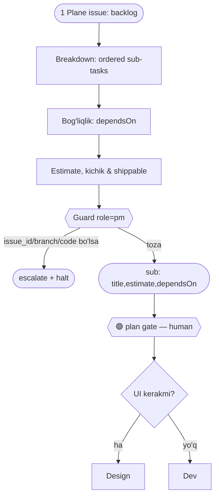
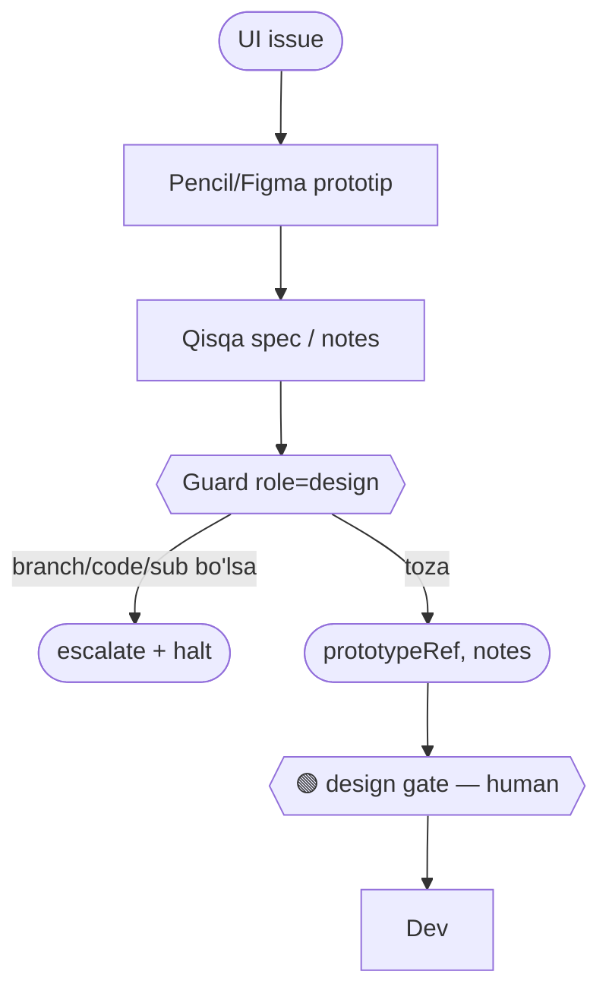
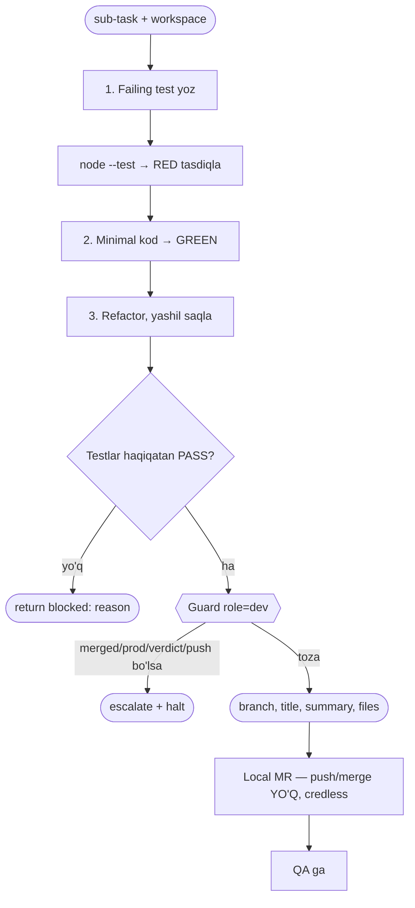
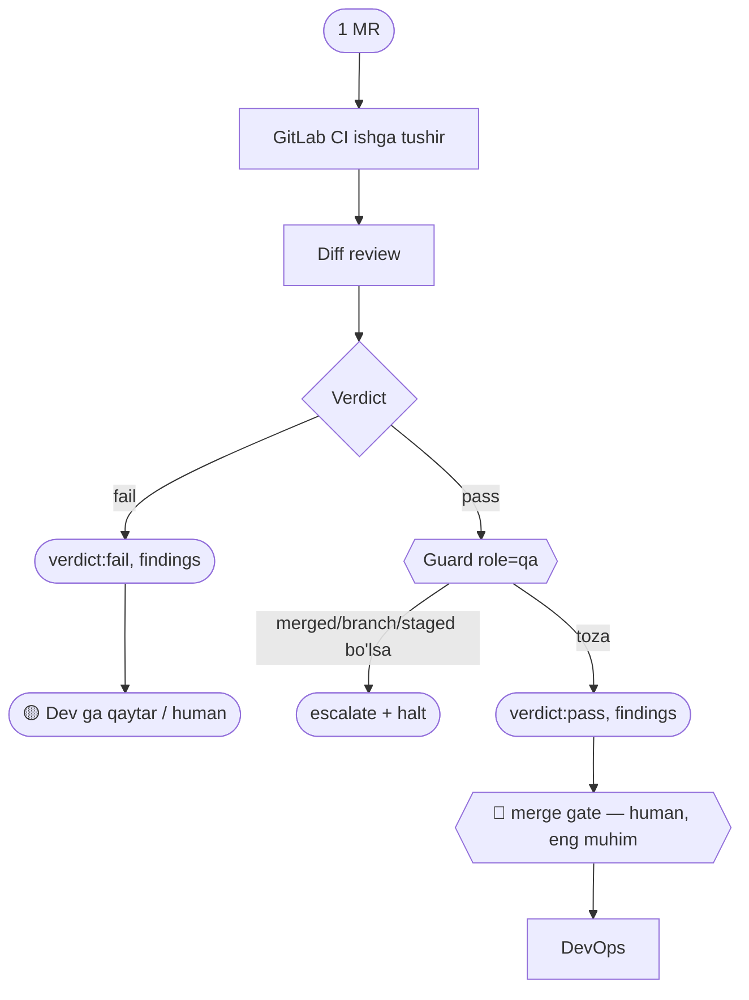
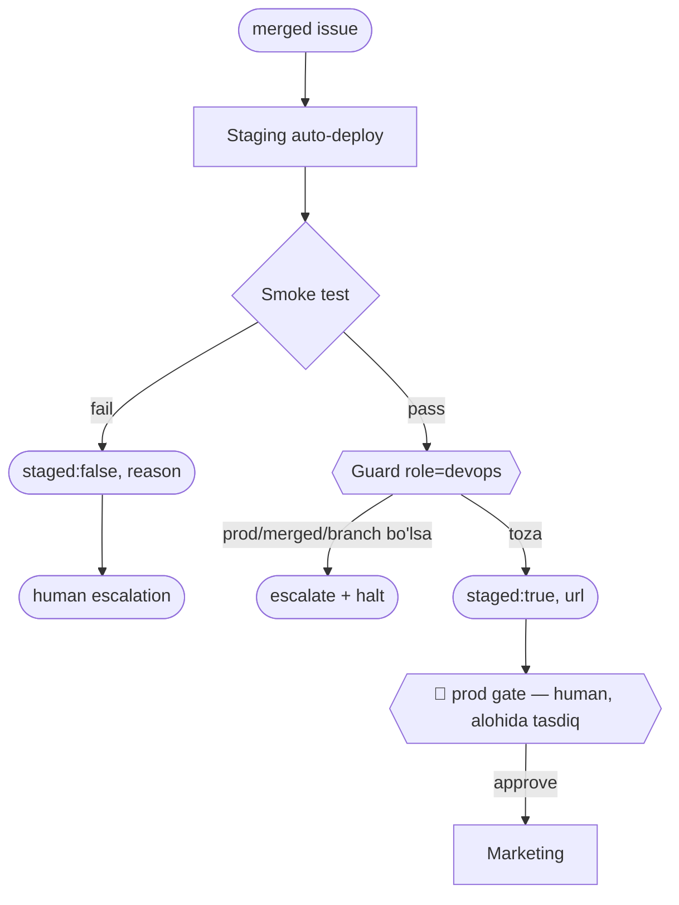
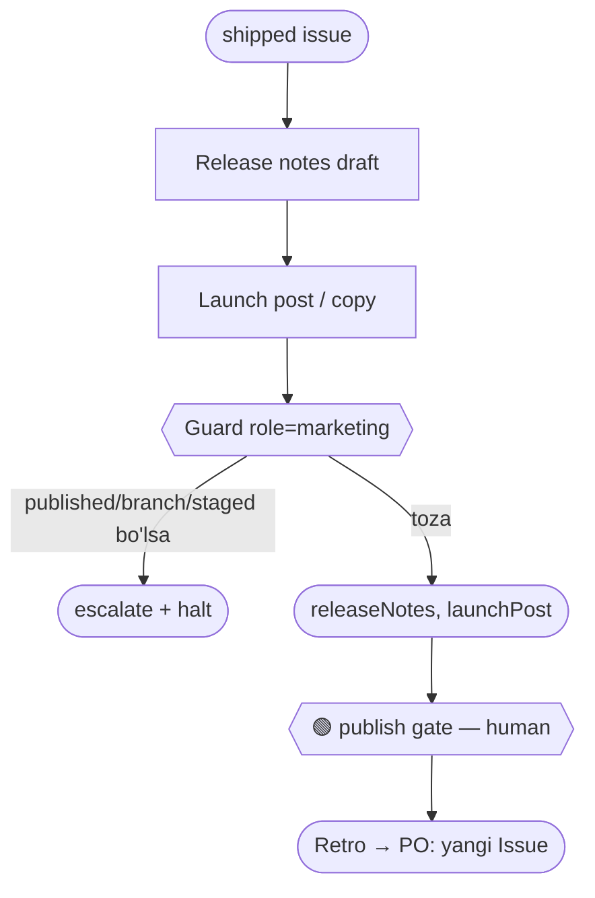
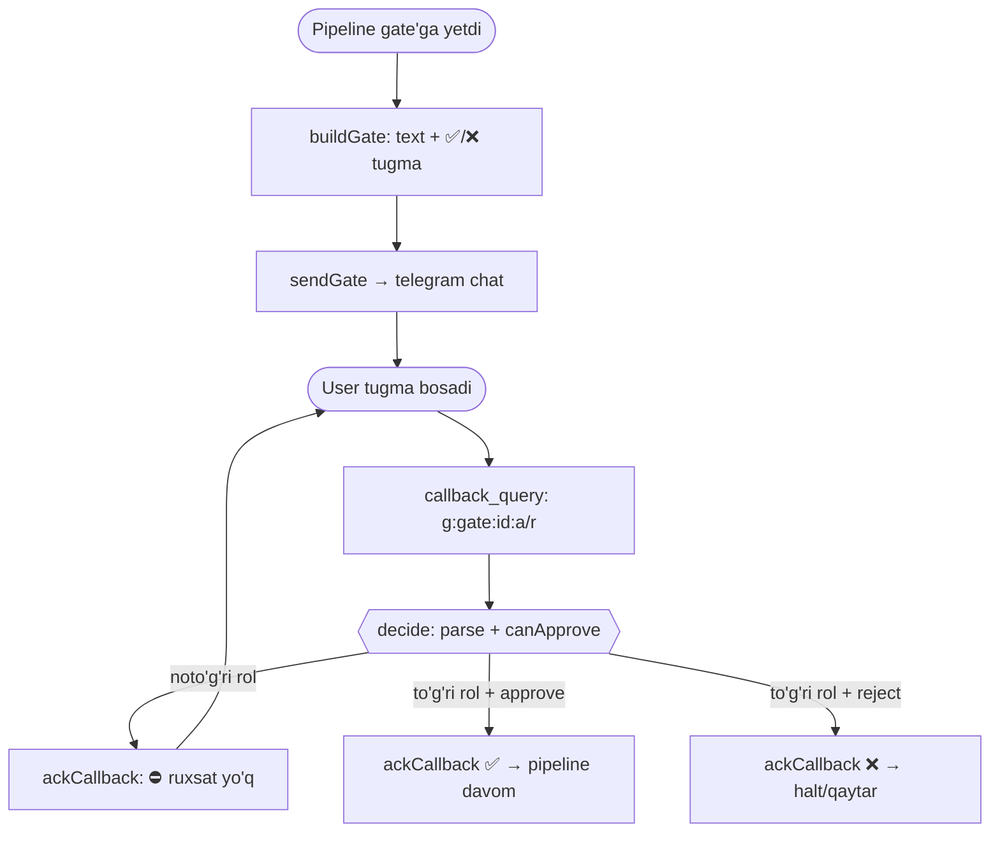

# Hermes ADLC — Role Flow & Guards

> Har bir role uchun ishlash blok-sxemasi (Mermaid). SDLC qadami **ADLC** ichki
> tsikliga 1:1 map qilinadi va har role o'z **guard chegarasi** (`obs/guard.mjs`)
> ichida ishlaydi — bir rol boshqasining artefaktini qaytarsa pipeline **rad etadi**
> (escalate + halt). Guard contract'lar `.claude/agents/*.md` da yozma, runtime
> enforcement `obs/guard.mjs` + `pipeline/pipeline.mjs` (`guarded()`).

---

## 1. SDLC ↔ ADLC moslik

| SDLC bosqich | ADLC stage | Role | Gate |
|--------------|-----------|------|------|
| Requirements / triage | 📝 spec | **PO** | 🟢 roadmap |
| Planning / breakdown | 📐 plan | **PM** | 🟢 plan |
| Design (UI bo'lsa) | 📐 plan | **Design** | 🟢 design |
| Implementation | 🔨 generate (TDD) | **Dev crew** | — (local, credless) |
| Testing / CI | 🧪 verify | **QA** | 🟡 fail→human |
| Code review | 🔍 review | **QA/reviewer** | 🔴 merge |
| Deployment | 🚀 ship | **DevOps** | 🔴 prod |
| Release / GTM | 🚀 ship → loop | **Marketing** | 🟢 publish |

**Asosiy qoida:** har role faqat o'z stage'ini bajaradi va faqat o'z chiqish
artefaktini qaytaradi. Keyingisini **gate** (human) yoki **orchestrator** (Hermes)
uzatadi — role o'zi sakrab o'tmaydi.

---

## 2. Guard matritsasi (`obs/guard.mjs` — `KEY_OWNER`)

| Role | Kirish | Chiqish (FAQAT) | TAQIQ (egasi) | Tool |
|------|--------|-----------------|---------------|------|
| **PO** | signal `{chat_id,…}` | `action, issue_id, type, priority, title, reason` | `sub`(pm) `branch/files`(dev) `verdict`(qa) `staged`(devops) `merged/prod`(gate) | `Read, plane*` |
| **PM** | 1 Plane issue | `sub[{title,estimate,dependsOn}]` | `issue_id`(po) `branch`(dev) `prototypeRef`(design) `verdict`(qa) `merged`(gate) | `Read, plane*` |
| **Design** | UI issue | `prototypeRef, notes` | `sub`(pm) `branch`(dev) `verdict`(qa) `issue_id`(po) | `Read, pencil*` |
| **Dev** | sub-task + workspace | `branch, title, summary, files` \| `blocked` | `merged/prod`(gate) `verdict`(qa) `staged`(devops) `issue_id`(po) `sub`(pm) | `Read, Write, Edit, Bash` (workspace) |
| **QA** | 1 MR | `verdict, findings` | `merged`(gate) `branch/files`(dev) `staged/prod`(devops) | `Read, Bash, gitlab*` (read-only) |
| **DevOps** | merged issue | `staged, url, reason` | `prod/deployedProd`(gate) `merged`(gate) `branch`(dev) `verdict`(qa) | `Read, Bash, gitlab*` |
| **Marketing** | shipped issue | `releaseNotes, launchPost` | `published`(gate) `branch`(dev) `staged/prod`(devops) | `Read, docmost*` |

> `human-gate:merge` · `human-gate:prod` · `human-gate:publish` — hech bir agent
> bu kalitlarni qaytara olmaydi. Faqat human gate o'rnatadi.

---

## 3. Umumiy pipeline oqimi

---

## 4. Per-role blok-sxemalar

Har sxema bir xil shaklda: **Kirish → SDLC mantiq (ADLC stage) → Guard → Chiqish → Gate**.
`Guard` tugun = `assertRoleOutput(role, out)` — buzilsa `escalate + halt`.

### 4.1 PO — Requirements (📝 spec)

### 4.2 PM — Planning (📐 plan)

### 4.3 Design — Design (📐 plan)

### 4.4 Dev crew — Implementation (🔨 generate · TDD)

### 4.5 QA — Testing + Review (🧪 verify · 🔍 review)

### 4.6 DevOps — Deployment (🚀 ship)

### 4.7 Marketing — Release/GTM (🚀 ship → loop)

---

## 5. Guard qanday majburlanadi (enforcement)

1. **Yozma contract** — `.claude/agents/<role>.md` `## Guard (chegara)` section
   (prompt darajasida agentga aytadi).
2. **Runtime** — `obs/guard.mjs`:
   - `KEY_OWNER` — har artefakt kaliti → egasi (role yoki `human-gate:*`).
   - `checkRoleOutput(role, out)` → `{ ok, violations:[{key,owner}] }`.
   - `assertRoleOutput(role, out)` → buzilsa `throw`.
3. **Pipeline** — `pipeline/pipeline.mjs` `guarded(role, fn, adapters, issue)`
   har role agent chiqishini tekshiradi; buzilsa `escalate()` (notify) + `throw`
   (sokin fail yo'q — §5.5 observability).

Test: `obs/guard.test.mjs` (10) + `pipeline/pipeline.test.mjs` guard case.

---

## 6. Human gate layer — role-based telegram

Gate'lar (🟢/🟡/🔴) endi telegramda **inline tugma** bilan tasdiqlanadi va faqat
**o'sha gate egasi rol** bosa oladi. Bu agent guard'ining odam tarafidagi juftligi:
agent o'z chiqishidan chiqib ketolmaydi, odam ham o'z rolidan tashqari gate'ni
tasdiqlolmaydi.

| Modul | Vazifa |
|-------|--------|
| `ingest/roles.mjs` | `HERMES_ROLES` env → `{user_id→role}`; `canApprove(map, userId, gate)`; `GATE_ROLE` (gate→rol) |
| `ingest/gate.mjs` | `buildGate()` payload (inline_keyboard) · `parseCallback()` · `decide()` (parse+authz) |
| `ingest/gate-io.mjs` | `sendGate()` / `ackCallback()` — telegram POST (fetch-injectable) |

**Gate → rol (kim tasdiqlaydi):** `roadmap→po` · `plan→pm` · `design→design` ·
`merge→reviewer` · `prod→devops` · `publish→marketing` · `admin` = hammasi.

**Oqim:**

**Config (`.env`):** `HERMES_ROLES={"<tg_user_id>":"<role>"}`. Misol
`.env.example` da. Fail-closed: rolsiz user yoki noma'lum gate → rad.

**Hali qurilmagan (keyingi slice):** real MCP ulanish (Faza 0, creds) + pipeline
gate nuqtalarini `AskUserQuestion` o'rniga `sendGate`/`decide` ga ulash (orchestrator
24/7 servis, arch §6-B). Modullar tayyor — wiring qoldi.

Test: `ingest/roles.test.mjs` (7) + `ingest/gate.test.mjs` (6) + `ingest/gate-io.test.mjs` (3).
